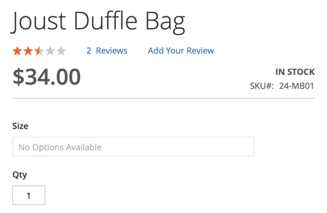

# Create Custom Product Option Type

Add an ability to show show informational custom options on the product view page.




## Kata Solution

Magento is partilly ready for adding new custom option types. In overall, the process is the following:

- init a new custom option type
- adjust custom option UI component for showing custom type specific fields
- extend catalog_product_option table to store an additional data
- define the frontend renderer and template for the new custom option type
- define a new validation model for the custom option type

Define a new custom option group and type.

`etc/product_options.xml`:

```xml
<?xml version="1.0"?>
<!-- MageKata: Create Custom Product Option Type -->
<config xmlns:xsi="http://www.w3.org/2001/XMLSchema-instance" xsi:noNamespaceSchemaLocation="urn:magento:module:Magento_Catalog:etc/product_options.xsd">
    <!-- Define a new option type -->
    <option name="information" label="Information" renderer="Magento\Catalog\Block\Adminhtml\Product\Edit\Tab\Options\Type\AbstractType">
        <inputType name="disabled_drop_down" label="Disabled Drop-Down" />
    </option>
</config>
```

Adjust the custom option UI component to register a new custom option group and type-specific fields.

`Glushko/MageKata/Ui/Product/Form/InformationCustomOptionModifier.php`:

```php
<?php
/**
 * MageKata: Create Custom Product Option Type
 */

declare(strict_types=1);

namespace Glushko\MageKata\Ui\Product\Form;

use Magento\Catalog\Ui\DataProvider\Product\Form\Modifier\CustomOptions;
use Magento\Framework\Stdlib\ArrayManager;
use Magento\Ui\Component\Form\Element\DataType\Text;
use Magento\Ui\Component\Form\Element\Input;
use Magento\Ui\Component\Form\Field;
use Magento\Ui\DataProvider\Modifier\ModifierInterface;

/**
 * Data provider for Information Product Option Type
 */
class InformationCustomOptionModifier implements ModifierInterface
{
    /**
     * Placeholder field name
     */
    const FIELD_PLACEHOLDER_NAME = 'placeholder';

    /**
     * @var ArrayManager
     */
    protected $arrayManager;

    /**
     * @param ArrayManager $arrayManager
     */
    public function __construct(
        ArrayManager $arrayManager
    ) {
        $this->arrayManager = $arrayManager;
    }

    /**
     */
    public function modifyData(array $data)
    {
        return $data;
    }

    /**
     * Define Information Option Type definition and definition of placeholder field which is a custom field needed to
     * configure this types of options
     *
     * @return array
     */
    public function modifyMeta(array $meta)
    {
        // add placeholder field configuration to container_type_static component
        $meta = $this->arrayManager->merge(
            'custom_options/children/options/children/record/children/container_option/children/' .
            'container_type_static/children',
            $meta,
            [
                'placeholder' => $this->getPlaceholderConfig(100),
            ]
        );

        // add information type configuration
        $meta = $this->arrayManager->merge(
            'custom_options/children/options/children/record/children/' .
            'container_option/children/container_common/children/type/arguments/data/config/groupsConfig',
            $meta,
            [
                'information' => $this->getInformationTypeConfig(),
            ]
        );

        return $meta;
    }

    /**
     * Retrieve definition of information group
     *
     * @return array
     */
    private function getInformationTypeConfig(): array
    {
        return [
            'values' => ['disabled_drop_down'],
            'indexes' => [
                CustomOptions::CONTAINER_TYPE_STATIC_NAME,
                static::FIELD_PLACEHOLDER_NAME
            ]
        ];
    }

    /**
     * Get config for "Placeholder" field
     *
     * @param int $sortOrder
     *
     * @return array
     */
    private function getPlaceholderConfig(int $sortOrder): array
    {
        return [
            'arguments' => [
                'data' => [
                    'config' => [
                        'label' => 'Placeholder',
                        'component' => 'Magento_Catalog/js/components/custom-options-component',
                        'componentType' => Field::NAME,
                        'formElement' => Input::NAME,
                        'dataScope' => static::FIELD_PLACEHOLDER_NAME,
                        'dataType' => Text::NAME,
                        'sortOrder' => $sortOrder,
                    ],
                ],
            ],
        ];
    }
}
```

For storing all additional information about new custom option type, it needs to init new columns in the catalog_product_option table.
Then Magento will save this data automatically.

`etc/db_schema.xml`:

```xml
<?xml version="1.0"?>
<!-- MageKata: Create Custom Product Option Type -->
<schema xmlns:xsi="http://www.w3.org/2001/XMLSchema-instance"
        xsi:noNamespaceSchemaLocation="urn:magento:framework:Setup/Declaration/Schema/etc/schema.xsd">
    <table name="catalog_product_option">
        <column xsi:type="varchar" name="placeholder" nullable="true" length="50" comment="Placeholder"/>
    </table>
</schema>
```

`etc/db_schema_whitelist.json`:

```json
{
    "catalog_product_option": {
        "column": {
            "placeholder": true
        }
    }
}
```

It needs to add also a frontend renderer for the new custom option type.

`view/frontend/layout/catalog_product_view.xml`:

```xml
<?xml version="1.0"?>
<!-- MageKata: Create Custom Product Option Type -->
<page xmlns:xsi="http://www.w3.org/2001/XMLSchema-instance" xsi:noNamespaceSchemaLocation="urn:magento:framework:View/Layout/etc/page_configuration.xsd">
    <body>
        <!-- Adds a frontend renderer for the information option type -->
        <referenceBlock name="product.info.options">
            <block class="Glushko\MageKata\Block\Product\CustomOption\InformationTypeBlock"
                   name="product.info.options.information"
                   as="information"
                   template="Glushko_MageKata::product/custom-option/information.phtml" />
        </referenceBlock>
    </body>
</page>
```

`Block/Product/CustomOption/InformationTypeBlock.php`:

```php
<?php
/**
 * MageKata: Create Custom Product Option Type
 */
declare(strict_types=1);

namespace Glushko\MageKata\Block\Product\CustomOption;

use Magento\Catalog\Block\Product\View\Options\Type\Select;

/**
 * Render custom option type on PDP
 */
class InformationTypeBlock extends Select
{
    // any additional rendering logic
}
```

`view/frontend/templates/product/custom-option/information.phtml`:

```php
<?php
/**
 * MageKata: Create Custom Product Option Type
 */

use Glushko\MageKata\Block\Product\CustomOption\InformationTypeBlock;

/** @var InformationTypeBlock $block */

$option = $block->getOption();
$class = ($option->getIsRequire()) ? ' required' : '';
$class .= ' ' . $option->getData('option_code');
$class .= ' ' . $option->getType();
?>
<div class="field disabled-custom-option <?= $block->escapeHtml($class) ?>">
    <label class="label">
        <span><?= $block->escapeHtml($option->getTitle()) ?></span>
    </label>
    <div class="control">
        <input type="text"
               id="options_<?= $block->escapeHtml($option->getId()) ?>"
               class="input-text product-custom-option"
               name="options[<?= $block->escapeHtml($option->getId()) ?>]"
               value="<?= $block->escapeHtml($option->getData('placeholder')) ?>"
               disabled
               readonly
        />
    </div>
</div>
```

Register a new plugin to add the new custom option group for the frontend custom option pool.
It's defined separatelly for some reason and doesn't depend on product_options.xml.

`Plugin/Product/AddCustomOptionGroupNamePlugin.php`:

```php
<?php
/**
 * MageKata: Create Custom Product Option Type
 */

declare(strict_types=1);

namespace Glushko\MageKata\Plugin\Product;

use Magento\Catalog\Model\Product\Option;

/**
 * Add group name for custom product option
 */
class AddCustomOptionGroupNamePlugin
{
    /**
     * Product disable drop down option type.
     */
    const OPTION_TYPE_INFORMATION = 'disabled_drop_down';

    /**
     * Product information options group.
     */
    const OPTION_GROUP_INFORMATION = 'information';

    /**
     * Add customized option group name, for render custom option type on PDP
     *
     * @param Option $subject
     * @param string $result
     * @param string|null $type
     *
     * @return mixed
     *
     * @SuppressWarnings(PHPMD.UnusedFormalParameter)
     */
    public function afterGetGroupByType(Option $subject, $result, $type = null)
    {
        if (self::OPTION_TYPE_INFORMATION === $type) {
            return self::OPTION_GROUP_INFORMATION;
        }

        return $result;
    }
}
```

`etc/di.xml`:

```xml
<?xml version="1.0"?>
<!-- MageKata: Create Custom Product Option Type -->
<config xmlns:xsi="http://www.w3.org/2001/XMLSchema-instance" xsi:noNamespaceSchemaLocation="urn:magento:framework:ObjectManager/etc/config.xsd">
    <!-- Adds a validation model for the custom option type (Magento hardcoded namespace where it should be, this is a workaround for that bottleneck)  -->
    <preference for="Magento\Catalog\Model\Product\Option\Type\Information" type="Glushko\MageKata\Model\Product\CustomOption\InformationTypeModel" />

    <type name="Magento\Catalog\Model\Product\Option">
        <plugin name="glushko_magekata_add_custom_option_to_group" type="Glushko\MageKata\Plugin\Product\AddCustomOptionGroupNamePlugin"/>
    </type>
</config>
```

A custom option validation model helps to safe process of the adding a product that has the new custom option type.

`Model/Product/CustomOption/InformationTypeModel.php`:

```php
<?php
/**
 * MageKata: Create Custom Product Option Type
 */
declare(strict_types=1);

namespace Glushko\MageKata\Model\Product\CustomOption;

use Magento\Catalog\Model\Product\Option\Type\DefaultType;
use Magento\Framework\Exception\LocalizedException;

/**
 * Class InformationTypeModel
 */
class InformationTypeModel extends DefaultType
{
    /**
     * Validate user input for option
     *
     * @param array $values
     *
     * @return $this
     *
     * @throws LocalizedException
     */
    public function validateUserValue($values)
    {
        $this->setIsValid(true);

        return $this;
    }
}
```
